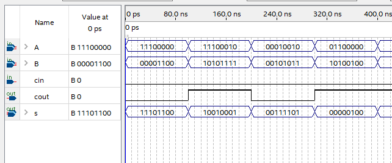

# Entradas
- A, B (vetores lógicos de 8bits)
    - entradas do somador, a operação
    será processada com base nesses valores
- Cin (1 bit)
    - Controle do component (por padrão será '0')
- Cout (1 bit)
    - Carry out do somador (vai um)
- S (vetor lógico de 8bits)
    - Saida padrão do resultado da soma

# Variaveis
-   temp
    - vetor lógico de 8bits, variavel auxiliar do processo
    ao somar bit a bit das entradas A e B, guardando o resultado em temp.
-   c
    - ira armazenar o bit Carry out da soma até que no final sera atribuida a Cout do component.

# portas
- And, Xor, OR (não componentizadas)
    - Portas necessárias para o somador operar corretamente

# WaveForm do circuito
### preview
</img>