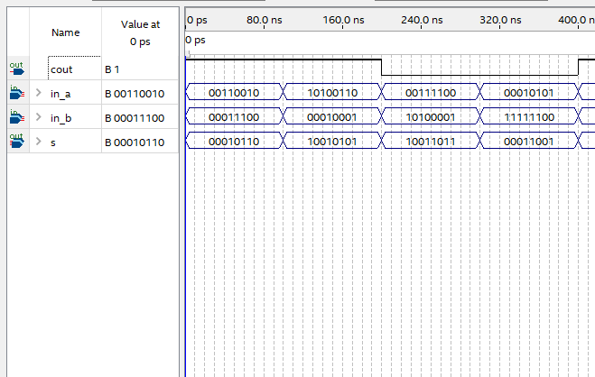

# Entradas
- in_A, in_B (vetores lógicos de 8bits)
    - entradas do subtrator, a operação
    será processada com base nesses valores
- Cout (1 bit)
    - Carry out do somador que sera usado como subtrator (vai um)
- s (vetor lógico de 8bits)
    - Saida padrão do resultado da subtração

# Componentes
-   somador8bits
-   p_xor

# WaveForm do circuito
### preview
</img>