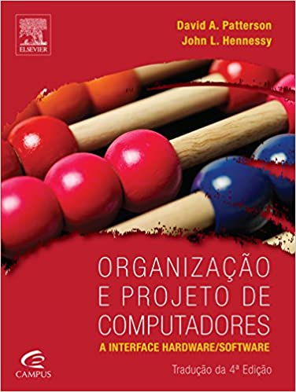

## Projeto Processador 8bits MIPS
### projeto final da disciplina de Arquiteture e organização de computadores

## Livro Base
<table >
<tr>
    <th>Organização e projeto de computadores</th>
    <th>Edição</th>
    <th>Autores</th>
</tr>
<tr style="vertical-align: top;">
    <th>
             
    </th>       
    <th>
        <i>4 ed</i>
    </th>
    <th>
        <i>David A. Patterson / John L. Hennessy </i>
    </th>
</tr>
</table>
